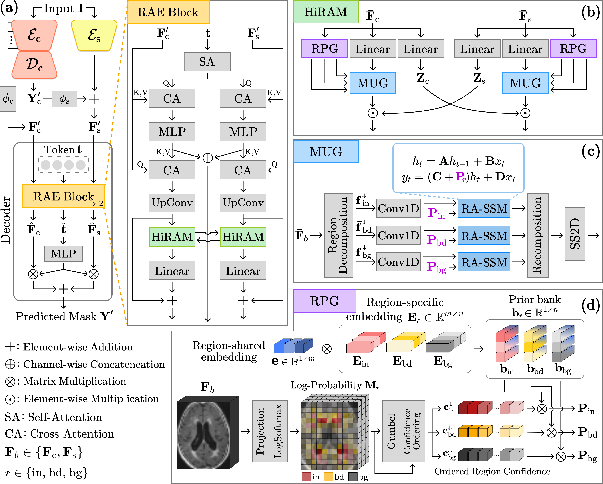

# HiRAM
This repository contains the implementation of the following paper:

> **HiRAM: Hierarchical Region-Aware Multi-Granularity Mamba for White Matter Lesion Segmentation**<br>
> Dahye Lee and Kwanseok Oh<br>
> Accepted at MICCAI 2026

## Overview
<p align="center"></p>

We propose **HiRAM** (Hierarchical Region-Aware Multi-granularity Mamba). HiRAM explicitly decomposes decoder features into interior, boundary, and background region-specific representations, and performs confidence-driven, non-causal state-space propagation over each region. By hierarchically integrating these multi-granularity, region-aware representations, HiRAM sharpens boundary sensitivity and fine-grained lesion delineation while preserving global contextual consistency.

- **Region-Tailored Prior Generator (RPG)**: routes each spatial location into interior / boundary / background groups by confidence and generates region-specific priors, instead of treating all pixels uniformly.
- **Multi-Granularity Mamba (MUG)**: propagates each region group through confidence-driven, non-causal state-space scans guided by RPG's priors, instead of a single fixed causal scan.
- **Hierarchical multi-granularity integration**: region-level and global-level representations are fused across branches to balance local boundary precision with global context.

> **Abstract**
>
> Accurate white matter (WM) lesion segmentation is essential for diagnosing and monitoring neurological disorders such as white matter hyperintensities and multiple sclerosis. However, this task remains highly challenging owing to the small and spatially scattered nature of lesions and their low contrast with surrounding tissues. Recently, the segment anything model (SAM) and its medical variants, often augmented with CNNs or Mamba, have shown promising potential for medical image segmentation, yet they struggle to reliably capture subtle lesion patterns and indistinct boundaries that demand fine-grained regional discrimination. In this work, we propose a novel hierarchical region-aware multi-granularity Mamba (HiRAM) incorporated into the SAM decoder. HiRAM explicitly decomposes the features into region-specific representations (i.e., interior, boundary, and background regions) and performs confidence-driven, non-causal state-space propagation. By incorporating region-aware modeling that prioritizes semantically reliable features and hierarchically integrates multi-granularity learning, our method enhances boundary sensitivity and fine-grained lesion delineation while preserving global contextual consistency. Comprehensive evaluations across two public challenge datasets reveal that HiRAM outperforms state-of-the-art methods, achieving unmatched segmentation accuracy and robustness.

## Requirements
```bash
pip install -r requirements.txt
```
The dev environment used Python 3.9 with PyTorch 2.4.1 (CUDA 12.4). If you need matching CUDA wheels:
```bash
pip install torch==2.4.1 torchvision==0.19.1 --extra-index-url https://download.pytorch.org/whl/cu124
```
Download the official SAM `vit_b` checkpoint and place it under `segment_anything/pretrained_weights/`:
```bash
mkdir -p segment_anything/pretrained_weights
wget -O segment_anything/pretrained_weights/sam_vit_b_01ec64.pth \
  https://dl.fbaipublicfiles.com/segment_anything/sam_vit_b_01ec64.pth
```
This path must then be set as `SAM.pretrain_path` in `HIRAM_config.yaml`.

## Data Preparation
Data organization, preprocessing, and checkpoint saving all follow the standard [nnUNet v2](https://github.com/MIC-DKFZ/nnUNet) convention. Set the environment variables:
```bash
export nnUNet_raw=/path/to/nnUNet_raw
export nnUNet_preprocessed=/path/to/nnUNet_preprocessed
export nnUNet_results=/path/to/nnUNet_results
```
Arrange your dataset under `nnUNet_raw` following nnUNet's naming convention:
```none
${nnUNet_raw}/
└── Dataset001_YourDataset/
    ├── imagesTr/
    │   ├── case_0000_0000.nii.gz
    │   └── ...
    ├── labelsTr/
    │   ├── case_0000.nii.gz
    │   └── ...
    └── dataset.json
```
Then run nnUNet's standard planning/preprocessing tool:
```bash
nnUNetv2_plan_and_preprocess -d <DATASET_ID> --verify_dataset_integrity
```

`setup.split_txt_path` in `HIRAM_config.yaml` points to a train/validation split file over this preprocessed dataset.

## Usage
Code layout:
- `HIRAM_config.yaml`: configuration file (dataset id/split, training setup, SAM/HiRAM settings)
- `HiRAM_train.py`: training entrypoint
- `HiRAM_inference.py`: inference entrypoint
- `nnunetv2/`: nnUNet v2 framework, extended to plug in the SAM/HiRAM network (`nnunetv2/utilities/get_network_from_plans.py`)
- `segment_anything/`: SAM backbone and the proposed **HiRAM** modules (`segment_anything/modeling/HiRAM.py`, `RAEblock.py`, `mask_decoder_HiRAM.py`, `sam_HiRAM.py`) plus LoRA utilities (`segment_anything/utils/LoRA.py`)

**1. Configure.** Edit `HIRAM_config.yaml`:
- `setup`: dataset_id, configuration, fold, split_txt_path, and training hyperparameters
- `SAM`: model_type (vit_b/HiRAM), model_name (SAM/LoRA), which components to update (image_encoder/prompt_encoder/mask_decoder), and pretrain_path (the SAM checkpoint downloaded above)

**2. Train.**
```bash
python HiRAM_train.py
```
Checkpoints are saved under `${nnUNet_results}/Dataset.../nnUNetTrainer__nnUNetPlans__<configuration>/fold_<fold>/`, following nnUNet's convention.

**3. Inference.** Set input_path, output_path, checkpoint_save_path, and fold at the bottom of `HiRAM_inference.py`, then run:
```bash
python HiRAM_inference.py
```

## Acknowledgements
This codebase is built upon [nnUNet](https://github.com/MIC-DKFZ/nnUNet) and [Segment Anything](https://github.com/facebookresearch/segment-anything).

## Citation
Citation information will be added upon publication.
